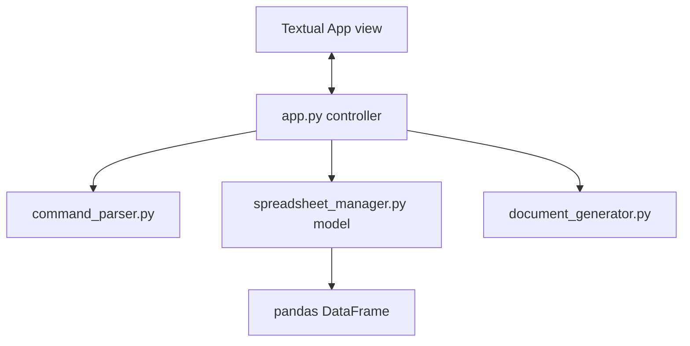
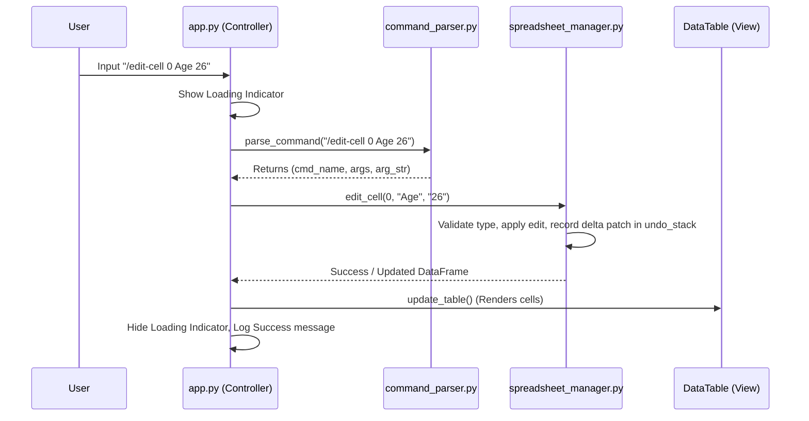
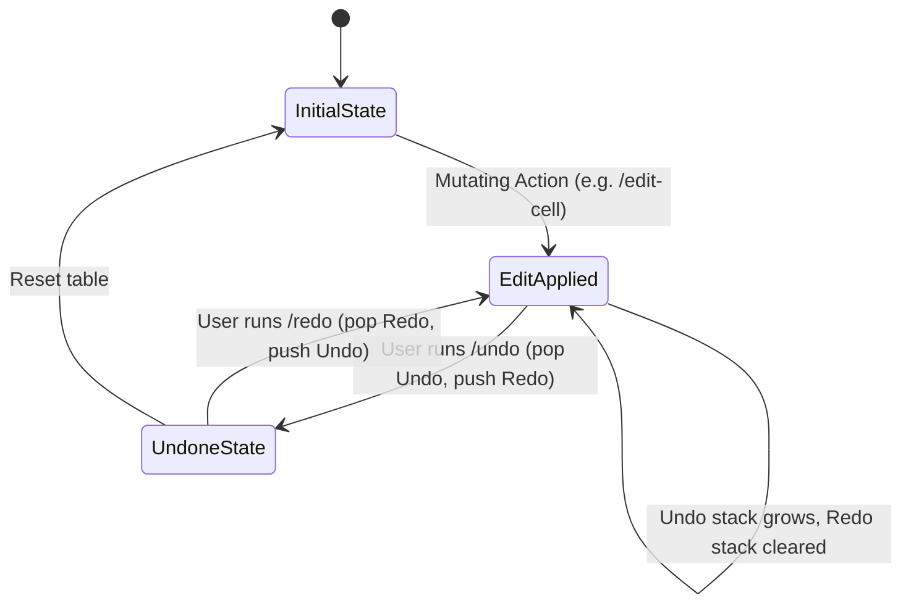

# Architecture Documentation

This document describes the high-level architecture and design patterns of the **T2D (Spreadsheet TUI Editor)** application.

## System Overview

T2D is structured as a Model-View-Controller (MVC) like system optimized for a Terminal User Interface (TUI). It leverages the **Textual** framework for the visual event loop, **pandas** for backend data storage/manipulation, and **python-docx / fpdf2** for output document generation.

## Core Components

1. **View/Controller (`app.py`)**:
   - Manages the Textual UI event loop.
   - Renders layouts: `DataTable`, `EmptyStatePanel`, `RichLog` (for status reports), `Input` (command bar), `Footer`, and `LoadingIndicator`.
   - Dispatches user commands asynchronously to prevent freezing the UI.
2. **Command Parser (`command_parser.py`)**:
   - Sanitizes and splits user input.
   - Leverages `shlex` for shell-like quoting (e.g., preserving space-containing cell values) while bypassing tokenization for complex pandas queries.
3. **Data Model (`spreadsheet_manager.py`)**:
   - Wraps a pandas DataFrame.
   - Handles row/column/cell operations, queries, sorting, and regex searches.
   - Maintains the dual-stack history tracking system for Undo/Redo.
4. **Exporters (`document_generator.py`)**:
   - Converts the pandas DataFrame into styled DOCX or PDF files.

---

## Command Processing Lifecycle

When a user submits a command in the input box, it traverses the system as follows:

---

## Undo/Redo Stack State Transitions

T2D implements an efficient dual-stack memory model. Rather than cloning the entire DataFrame for every operation, the `SpreadsheetManager` records a differential delta patch (a copy of the affected DataFrame segment or structure state before modification).

- **Undo Stack**: Stores the past states / patches.
- **Redo Stack**: Stores the undone states / patches to allow re-applying them.

### Stack Management Rules
1. **New Action**: Push the pre-action state to the `undo_stack` and **clear** the `redo_stack`.
2. **Undo Action**: Pop the top state from the `undo_stack`, push the *current* state to the `redo_stack`, and restore the popped state.
3. **Redo Action**: Pop the top state from the `redo_stack`, push the *current* state to the `undo_stack`, and restore the popped state.

---

## Technology Rationale

The core tech stack was selected to maximize speed of development, portability, and readability:
- **Textual**: Modern Python TUI framework with async layout systems, CSS support, reactive states, and robust keyboard/mouse input handling.
- **pandas**: The industry standard for tabular data analysis. It provides highly optimized C-implemented shape, query, sorting, and type-coercion algorithms.
- **python-docx**: The most popular Python library for generating Word documents, allowing full XML/namespaces level styling controls for tables.
- **fpdf2**: Lightweight, standard PDF generator for Python that does not require external binary dependencies (unlike wkhtmltopdf/WeasyPrint).

---

## Known Limitations & Mitigation Roadmap

1. **Large File Memory Footprint**:
   - *Issue*: Storing historical states/patches for very large files (>500MB) can lead to substantial RAM usage.
   - *Mitigation*: Currently, we record structural changes as delta patches. In future releases, we plan to serialize history steps to a temporary SQLite database on disk rather than holding them in memory.
2. **PDF Column Auto-fitting Width Limits**:
   - *Issue*: When there are a very large number of columns (e.g. >15 columns), page text scaling may compress headers significantly on A4.
   - *Mitigation*: We switch to Landscape mode automatically for >6 columns. We can add custom column-selection configurations to export only chosen subsets of columns.
