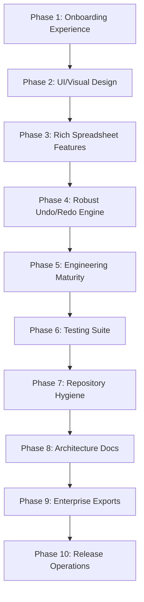

# Enterprise Level-Up Implementation Plan - Spreadsheet TUI Editor (T2D)

This document details a comprehensive, phased roadmap to elevate this project from a prototype into a professional, enterprise-grade, SWE-ready software system.

> [!IMPORTANT]
> **No changes have been made to the repository code.** This file acts as the formal blueprint. Each phase is decomposed into specific tasks, and every task is broken down into actionable steps with references, guides, and technical explanations.

---

## Plan Structure Overview

---

## Phase 1: Polished Onboarding Experience
**Goal**: Make it obvious in 30 seconds what the project does, how to configure it, and how to verify its outputs.

### Task 1.1: Build Visual Demos and Assets
- **Goal**: Create high-fidelity visual representations of the TUI in action.
- **Steps**:
  - **Step 1.1.1**: Record a terminal interaction session using `asciinema`. Export the recording to an optimized SVG/GIF animation using `asciicast2gif`.
    - *Explanation*: Visual elements increase developer engagement. SVG animation maintains scaling crispness without the blocky artifacts of standard GIFs.
    - *Guides/References*: [asciinema CLI Documentation](https://asciinema.org/docs/usage) | [asciicast2gif Compiler](https://github.com/asciinema/asciicast2gif)
  - **Step 1.1.2**: Create a `/docs/assets` folder in the repository and store all screenshots, demo videos, and animated assets inside it to avoid root folder pollution.
    - *Explanation*: Grouping assets in a standard assets path enforces project cleanliness.

### Task 1.2: Restructure README Quick Start
- **Goal**: Provide a fail-proof onboarding guide for new developers.
- **Steps**:
  - **Step 1.2.1**: Refine `README.md` to display badges (CI build status, tests, coverage, license) at the top, followed immediately by a 30-second "What is this?" elevator pitch.
  - **Step 1.2.2**: Add a detailed "Quick Start" section with clear cut-and-paste commands for setup, virtual environment activation across platforms (Bash, Cmd, PowerShell), and TUI initialization.
    - *Guides/References*: [Standard README Best Practices](https://github.com/othneildrew/Best-README-Template)
  - **Step 1.2.3**: Define a "Sample Walkthrough" section showing exact inputs (e.g. loading `sample_data.csv`, running a filter, and exporting to PDF) with its expected terminal logs and result files.

---

## Phase 2: UI & Visual Design Refinement
**Goal**: Refine layouts, add missing state overlays, and style interactive data table items to transition from "prototype" to "product".

### Task 2.1: Modernize CSS styling tokens in `app.tcss`
- **Goal**: Establish a cohesive, clean color palette and border system.
- **Steps**:
  - **Step 2.1.1**: Implement color variables (design tokens) at the `:link` or base selector level in `app.tcss` for dark-gray backgrounds, bright neon cyan accents, and status color states.
    - *Explanation*: Centralizing colors in variables allows global skinning (e.g. Light Mode) in the future.
    - *Guides/References*: [Textual CSS Guide: Variables](https://textual.textualize.io/guide/styles/#variables)
  - **Step 2.1.2**: Replace sharp borders with rounded panel borders (`round` style) and configure margins to prevent widgets from cluttering together.

### Task 2.2: Build Reactive State Layouts
- **Goal**: Gracefully handle loading, empty, and crash/error scenarios.
- **Steps**:
  - **Step 2.2.1**: Implement a custom `EmptyStatePanel` widget. When no spreadsheet is loaded, render this centered panel with clear, styled instructions and a button to load the sample file.
    - *Explanation*: Helps users who start the app without parameters know what to do next.
    - *Guides/References*: [Textual Widget Customization](https://textual.textualize.io/guide/custom-widgets/)
  - **Step 2.2.2**: Add a `LoadingScreen` overlay using Textual's `LoadingIndicator` during spreadsheet parsing or PDF document rendering tasks.
    - *Explanation*: Prevents UI lockup indicators during intensive file operations.
    - *Guides/References*: [Textual Loading Indicator](https://textual.textualize.io/widget_gallery/#loadingindicator)

### Task 2.3: Improve Table Interaction Aesthetics
- **Goal**: Make data cells highly readable and navigable.
- **Steps**:
  - **Step 2.3.1**: Style the DataTable cell focus (`.datatable--cursor`) with subtle neon color palettes and border borders instead of solid black fills to keep text readable.
  - **Step 2.3.2**: Configure alternating row backgrounds (zebra styling) inside the CSS using `DataTable > .datatable--odd-row` and `DataTable > .datatable--even-row` classes.

---

## Phase 3: Rich Spreadsheet Features
**Goal**: Provide users with robust tools to edit, search, shape, and structure their spreadsheets.

### Task 3.1: Data Table Shape Operations
- **Goal**: Support structural modifications like inserting and renaming table elements.
- **Steps**:
  - **Step 3.1.1**: Write `insert_row(row_idx, data_dict)` and `insert_column(col_name, default_value, position)` methods inside `SpreadsheetManager` that manipulate the underlying pandas DataFrame.
    - *Explanation*: Enforces structural modification capability without requiring manual CSV editing.
    - *Guides/References*: [pandas.DataFrame.insert](https://pandas.pydata.org/docs/reference/api/pandas.DataFrame.insert.html)
  - **Step 3.1.2**: Implement `rename_column(old_name, new_name)` with validation to ensure the new name does not clash with existing columns.
    - *Guides/References*: [pandas.DataFrame.rename](https://pandas.pydata.org/docs/reference/api/pandas.DataFrame.rename.html)

### Task 3.2: Find/Replace and Regex Engine
- **Goal**: Support bulk values modifications.
- **Steps**:
  - **Step 3.2.1**: Implement `/find <pattern>` and `/replace <pattern> <replacement> [col_name]` slash commands.
  - **Step 3.2.2**: Use regular expressions via Python's `re` module to locate and update matches, displaying the count of updated cells in the logs.
    - *Guides/References*: [Python standard 're' module](https://docs.python.org/3/library/re.html)

### Task 3.3: Type-Aware Validation and Parsing
- **Goal**: Maintain data integrity and format dates/booleans/nulls correctly.
- **Steps**:
  - **Step 3.3.1**: Validate cell inputs against the column's pandas data type (dtype) prior to saving the edit. Raise helpful validation errors instead of corrupting data or casting integers to strings.
  - **Step 3.3.2**: Detect date-formatted strings automatically using `pd.to_datetime` and format cell displays consistently. Render null values (NaN) with custom empty placeholding character configurations.
    - *Guides/References*: [pandas.to_datetime](https://pandas.pydata.org/docs/reference/api/pandas.to_datetime.html)

---

## Phase 4: Robust Undo/Redo Engine
**Goal**: Re-architect history tracking to support bidirectional state navigation and visual feedback.

### Task 4.1: Dual-Stack History Architecture
- **Goal**: Support standard Undo and Redo operations cleanly.
- **Steps**:
  - **Step 4.1.1**: Re-engineer the history tracking inside `SpreadsheetManager` to use two list stacks: `self.undo_stack` and `self.redo_stack`.
    - *Explanation*: When a mutating action occurs, push the current state to the `undo_stack` and clear the `redo_stack`.
  - **Step 4.1.2**: Implement `/redo` (and shortcut `Ctrl+Y`) which pops from `redo_stack`, pushes the current state to `undo_stack`, and loads the popped state.
  - **Step 4.1.3**: Structure the stacks to store differential/delta changes (patches) rather than entire DataFrame copies for huge files to save memory.
    - *Guides/References*: [Command Design Pattern in Python](https://refactoring.guru/design-patterns/command/python/example)

### Task 4.2: Visual History Indicators
- **Goal**: Show history availability status dynamically in the interface.
- **Steps**:
  - **Step 4.2.1**: Create visual badges or indicators in the TUI Footer (e.g. `[U] Undo Available` | `[R] Redo Available`) which light up or dim depending on stack size.
  - **Step 4.2.2**: Log state changes in the `RichLog` console (e.g. "Action undone. Reverted back to state #4: Row deleted").

---

## Phase 5: Engineering Maturity & Tooling
**Goal**: Standardize code structure, incorporate automated quality checkers, and enforce type safety.

### Task 5.1: Module Deconstruction and Refactoring
- **Goal**: Decouple modules to make the code maintainable.
- **Steps**:
  - **Step 5.1.1**: Separate the command parsing logic from the visual loop in `app.py` into a specialized `command_parser.py` module.
    - *Explanation*: Decreases monolithic complexity and allows testing commands in isolation.
  - **Step 5.1.2**: Apply comprehensive type annotations (PEP 484) across all methods, incorporating standard constructs from the `typing` module (`List`, `Dict`, `Tuple`, `Optional`).
    - *Guides/References*: [Python Typing Documentation](https://docs.python.org/3/library/typing.html)

### Task 5.2: Styling, Linting, and Hooks
- **Goal**: Automate code consistency checks.
- **Steps**:
  - **Step 5.2.1**: Add a `pyproject.toml` file configuring `ruff` (linter and formatter) and `black` rules.
    - *Explanation*: Standardizes styling, imports sorting, and syntax rules across the project.
    - *Guides/References*: [Ruff Configuration](https://docs.astral.sh/ruff/configuration/)
  - **Step 5.2.2**: Integrate `.pre-commit-config.yaml` to run local tests and linting automatically before every git commit.
    - *Guides/References*: [Pre-commit Installation Guide](https://pre-commit.com/)

### Task 5.3: Continuous Integration (CI) Pipeline
- **Goal**: Protect code quality through automated server-side checks.
- **Steps**:
  - **Step 5.3.1**: Create a GitHub Actions workflow file: `.github/workflows/ci.yml`.
  - **Step 5.3.2**: Configure the runner to test across multiple Python versions (3.9, 3.10, 3.11, 3.12, 3.13, 3.14), checking code formatting, linting rules, and running unit tests.
    - *Guides/References*: [GitHub Actions: Building Python Apps](https://docs.github.com/en/actions/automating-builds-and-tests/building-and-testing-python)

---

## Phase 6: Comprehensive Testing Suite
**Goal**: Expand automated validation beyond basic checks to ensure stability across boundary conditions.

### Task 6.1: Command Parser Unit Testing
- **Goal**: Validate input handling against bizarre syntax inputs.
- **Steps**:
  - **Step 6.1.1**: Create `test_command_parser.py` containing test cases asserting correct tokenization for spaced values, quotes (single vs double), missing parameters, and invalid command prefixes.
    - *Explanation*: Ensures command parsing won't crash the TUI on malformed user inputs.

### Task 6.2: Boundary and Edge-Case Table Tests
- **Goal**: Assert business logic robustness against outlier data structures.
- **Steps**:
  - **Step 6.2.1**: Write test cases for spreadsheet boundaries: empty files, sheets with special symbols in headers, columns filled with duplicate headers, indexing invalid bounds (out-of-range rows/cols), and empty queries.
    - *Guides/References*: [Python unittest.TestCase Assertions](https://docs.python.org/3/library/unittest.html#assert-methods)

### Task 6.3: TUI Integration Tests
- **Goal**: Verify UI reactive workflows programmatically.
- **Steps**:
  - **Step 6.3.1**: Utilize Textual's specialized `AppTest` test client to simulate input, command submission, and data table content assertions without opening a physical shell screen.
    - *Guides/References*: [Textual Testing Guide](https://textual.textualize.io/guide/testing/)

---

## Phase 7: Repository Hygiene & Standards
**Goal**: Standardize project files to meet open-source and professional repository requirements.

### Task 7.1: Setup Hygiene Configuration Files
- **Goal**: Lay down guidelines for formatting, license, and contributions.
- **Steps**:
  - **Step 7.1.1**: Add a `.editorconfig` file defining tab configurations, trim trailing whitespace rules, and line ending types.
    - *Guides/References*: [EditorConfig Specs](https://editorconfig.org/)
  - **Step 7.1.2**: Add an open-source `LICENSE` (e.g. MIT) file and a structured `CONTRIBUTING.md` documenting onboarding policies, branch naming structures, and coding standards.

### Task 7.2: Issue & PR Templates
- **Goal**: Standardize community issue reporting and code submissions.
- **Steps**:
  - **Step 7.2.1**: Set up standard template files under `.github/ISSUE_TEMPLATE/` (bug reports, feature requests) and `.github/pull_request_template.md`.
    - *Guides/References*: [GitHub Templates Guide](https://docs.github.com/en/communities/using-templates-to-encourage-useful-issues-and-pull-requests/about-issue-and-pull-request-templates)

---

## Phase 8: Architecture Documentation
**Goal**: Explicitly outline code pathways, technology rationales, and design paradigms.

### Task 8.1: Write `ARCHITECTURE.md`
- **Goal**: Maintain a reference document for core system design.
- **Steps**:
  - **Step 8.1.1**: Document the command processing flow, detailing how strings travel from the input bar, get parsed by `shlex`, processed in the parser module, executed by the DataFrame manager, and updated in the DataTable grid.
  - **Step 8.1.2**: Write Mermaid state-transition and sequence diagrams to illustrate core workflows (e.g. Undo/Redo tracking, Export triggers).
    - *Guides/References*: [Mermaid Diagrams in Markdown](https://mermaid.js.org/intro/getting-started.html)

### Task 8.2: Technology Rationale & Limits
- **Goal**: Describe design trade-offs and future plans.
- **Steps**:
  - **Step 8.2.1**: Document why the specific core stack was chosen (`Textual`, `pandas`, `python-docx`, `fpdf2`).
  - **Step 8.2.2**: Formulate a "Known Limitations" log (e.g. extreme memory footprints for files >500MB) and outline mitigation roadmaps.

---

## Phase 9: Enterprise-Grade Export Layouts
**Goal**: Make exported PDF and Word files meet professional business styling criteria.

### Task 9.1: Styled PDF Layout Customizer
- **Goal**: Elevate PDF readability and structural format controls.
- **Steps**:
  - **Step 9.1.1**: Add layout parameters to `/export-pdf`: page orientation defaults, margin paddings, filename naming templates, and paper sizes (A4, Letter, Legal).
  - **Step 9.1.2**: Configure automated page headers showing filename and generation date, footers showing page metrics ("Page X of Y"), and adaptive column width fitting algorithms.
    - *Guides/References*: [fpdf2 page header/footer documentation](https://py-pdf.github.io/fpdf2/HeadersAndFooters.html)

### Task 9.2: Bidirectional Spreadsheet Conversions
- **Goal**: Support round-tripping modified files.
- **Steps**:
  - **Step 9.2.1**: Implement `/export-csv` and `/export-excel` commands to allow saving modified spreadsheets back to data formats.
  - **Step 9.2.2**: Ensure that when saving back to Excel, previous column widths, date format parameters, and sheet numbers are preserved or safely handled.

---

## Phase 10: Product Polish & Release
**Goal**: Establish clear versioning, changelog tracking, and release management workflows.

### Task 10.1: Semantic Releases & Versioning
- **Goal**: Standardize version numbers and tracking logs automatically.
- **Steps**:
  - **Step 10.1.1**: Set up `semantic-release` or similar tooling to inspect conventional commit logs and automatically increment version tags (e.g. v1.1.0) on branch merges.
    - *Guides/References*: [Semantic Release Guide](https://github.com/semantic-release/semantic-release)
  - **Step 10.1.2**: Create a structured [CHANGELOG.md](file:///c:/Users/sorou/OneDrive/Desktop/table%20to%20doc/CHANGELOG.md) to log updates under clear headings (Features, Bug Fixes, Documentation, Chore).
